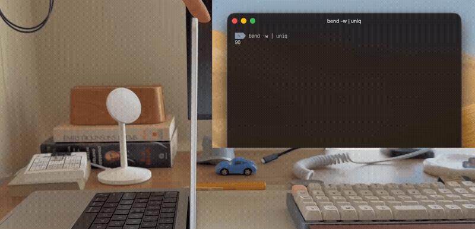

# Bend

Bend lets you read the MacBook lid angle sensor, built in Zig.

## Installation

**Homebrew (recommended)**
```bash
brew install mnk400/tap/bend
```

**Shell script**
```bash
curl -fsSL https://raw.githubusercontent.com/mnk400/bend/main/install.sh | bash
```

> Requires Input Monitoring permission — grant it in System Settings → Privacy & Security.

## Usage

Bend has the following modes:
- (default): Print the lid angle once and exit
- (watch mode) `-w` or `--watch`: Print the lid angle continuously, a live feed
- (wait mode) `--wait-until`: Block until angle reaches threshold, then exit

**Options**

- `-d`, `--delta`: Show change in angle since last reading (use with `--watch`)
- `-i`, `--interval`: Interval for polling angle reads in watch or wait mode (in seconds)
- `--timeout`: Optional timeout in wait mode
- `-h`, `--help`: Shows help
- `-v`, `--version`: Show version



## Build from source

Requires Zig 0.15+.

```bash
zig build                             # build to zig-out/bin/bend
zig build run -- --watch --interval 0.3
```
